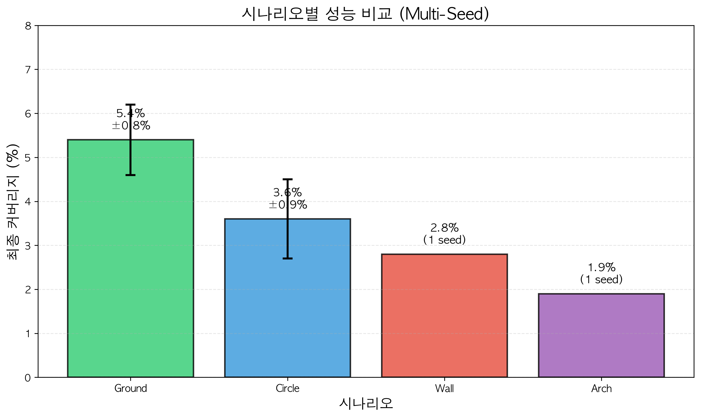
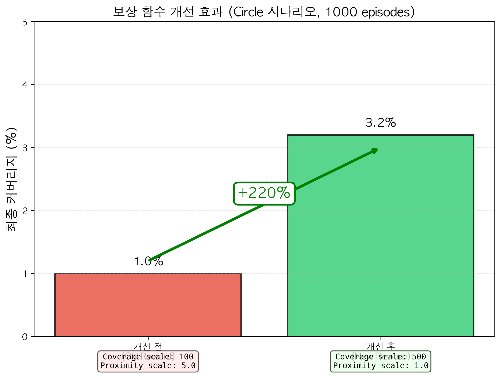
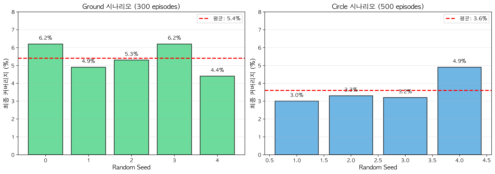
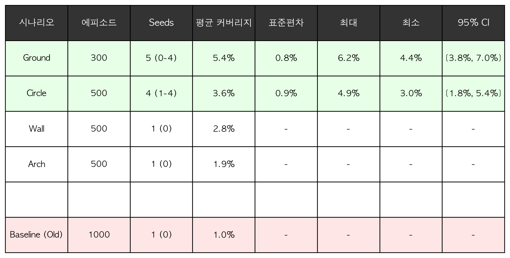

# RL Particle Control: 강화학습 기반 2D 파티클 분수 제어

## 1. 프로젝트 주제 및 목표

### 주제
Deep Q-Network (DQN)를 사용하여 2D 공간에서 파티클 분수의 발사 각도와 속도를 제어함으로써 지정된 타겟 영역을 최대한 커버하는 강화학습 에이전트 개발

### 목표
- **주요 목표**: 파티클 발사 제어를 통해 타겟 영역 커버리지 최대화
- **학습 과제**: 중력, 마찰 등 물리적 제약 하에서 최적의 제어 정책 학습
- **실제 응용**: 소방 호스 제어, 스프링클러 시스템, 페인트 스프레이 등 실제 물리 시스템 시뮬레이션

### 물리 기반 시나리오
본 프로젝트는 실제 물리 상황을 반영한 4가지 시나리오를 제공합니다:

| 시나리오 | 설명 | 물리적 상황 |
|---------|------|------------|
| **circle** | 원형 타겟 (기본) | 단순한 영역 커버 |
| **wall** | 벽면 페인팅/소화 | 수직 벽면의 특정 영역 (소방 호스, 페인트 스프레이) |
| **ground** | 바닥 관개 | 땅 위의 여러 영역 (농업 스프링클러, 정원 관개) |
| **arch** | 분수 아치 | 포물선 궤적을 따르는 영역 (장식용 분수) |

---

## 2. 환경 및 데이터셋 설명

### 환경 파라미터

본 프로젝트는 시뮬레이션 환경으로 별도의 데이터셋이 필요하지 않습니다. 환경은 다음과 같이 구성됩니다:

| 파라미터 | 값 | 설명 |
|---------|-----|------|
| `max_steps` | 200 | 에피소드당 최대 스텝 수 |
| `dt` | 0.02 | 시뮬레이션 시간 간격 (초) |
| `gravity` | -3.0 | 중력 가속도 (y축 아래 방향) |
| `friction` | 0.99 | 공기 저항 계수 |
| `emitter_pos` | (0.5, 0.05) | 발사기 위치 (x, y) |
| `angle_deg_range` | (30°, 150°) | 발사 각도 범위 |
| `speed_range` | (1.5, 4.0) | 발사 속도 범위 |
| `particles_per_step` | 50 | 매 스텝당 생성되는 파티클 수 |
| `state_grid_size` | 8 × 8 | State 표현용 그리드 크기 |
| `coverage_grid_size` | 64 × 64 | Coverage 계산용 그리드 해상도 |

### 물리 시뮬레이션

각 스텝마다 다음의 물리 법칙이 적용됩니다:

```
속도 업데이트: v_y(t+1) = v_y(t) + gravity × dt
위치 업데이트: pos(t+1) = pos(t) + vel(t+1) × dt
마찰 적용: vel(t+1) = vel(t+1) × friction
```

파티클은 화면 밖으로 나가면 제거되며, 타겟 마스크와의 교집합을 통해 커버리지가 계산됩니다.

### 전처리
- **상태 정규화**: 시간, 각도, 속도는 [0, 1] 범위로 정규화
- **히스토그램 정규화**: 8×8 파티클 분포는 합이 1이 되도록 정규화
- **그리드 양자화**: 연속적인 파티클 위치를 이산 그리드로 변환

---

## 3. State, Action, Reward 설계

### State (상태 공간)

**차원**: 67차원 벡터

**구성 요소**:
```
State = [time_norm, angle_norm, speed_norm, particle_histogram_8x8]
        \_________3차원_________/  \__________64차원__________/
```

1. **time_norm** (1차원): 현재 스텝 / 최대 스텝 (에피소드 진행률)
2. **angle_norm** (1차원): (현재 각도 - 최소 각도) / 각도 범위
3. **speed_norm** (1차원): (현재 속도 - 최소 속도) / 속도 범위
4. **particle_histogram** (64차원): 8×8 그리드에 파티클 분포를 히스토그램으로 표현 (합이 1)

**설계 의도**:
- 시간 정보로 에피소드 종료를 인식
- 현재 제어 파라미터 (각도, 속도)를 명시적으로 제공
- 파티클 분포를 통해 현재 커버리지 상황을 간접적으로 파악

### Action (행동 공간)

**타입**: 이산 행동 공간 (Discrete)
**크기**: 9개 행동

**행동 매핑**:

| Action | 각도 변화 | 속도 변화 | 설명 |
|--------|----------|----------|------|
| 0 | -5° | 0 | 각도만 감소 |
| 1 | +5° | 0 | 각도만 증가 |
| 2 | 0 | -10% | 속도만 감소 |
| 3 | 0 | +10% | 속도만 증가 |
| 4 | -5° | -10% | 각도↓ 속도↓ |
| 5 | -5° | +10% | 각도↓ 속도↑ |
| 6 | +5° | -10% | 각도↑ 속도↓ |
| 7 | +5° | +10% | 각도↑ 속도↑ |
| 8 | 0 | 0 | 유지 |

**설계 의도**:
- 단순한 이산 행동 공간으로 학습 안정성 확보
- 각도와 속도를 독립적 또는 동시에 조정 가능
- 유지 행동(8)으로 현재 설정 지속 가능

### Reward (보상 함수)

**다층 보상 구조**:

```python
reward = coverage_reward_scale × Δcoverage          # 커버리지 증가분
       + current_coverage_scale × coverage          # 현재 커버리지
       + proximity_reward_scale × proximity_reward  # 근접 보상
       - penalty_lambda × lost_fraction             # 손실 페널티
```

**보상 스케일 (최종 튜닝 값)**:

| 항목 | 값 | 설명 |
|------|-----|------|
| `coverage_reward_scale` | 500.0 | 새로운 영역 커버 시 높은 보상 |
| `current_coverage_scale` | 100.0 | 높은 커버리지 유지 장려 |
| `proximity_reward_scale` | 1.0 | 타겟 근처 파티클에 대한 보상 (희소성 완화) |
| `penalty_lambda` | 0.0 | 파티클 손실 페널티 (미사용) |

**보상 설계 의도**:
1. **Coverage Reward**: 새로운 영역을 커버할 때 큰 보상 제공 (주요 학습 신호)
2. **Current Coverage Reward**: 높은 커버리지를 지속적으로 유지하도록 유도
3. **Proximity Reward**: 타겟 근처(0.2 이내)에 파티클이 있으면 보상 (초기 탐색 개선, 희소 보상 문제 완화)

**Proximity Reward 계산**:
- 타겟 마스크 중심에서 각 파티클까지의 거리 계산
- 0.2 이내의 파티클 중 **가장 가까운** 파티클만 보상
- `proximity_reward = max(0, 0.2 - distance)` (거리가 가까울수록 높은 보상)

---

## 4. 강화학습 알고리즘 및 Hyperparameter

### 알고리즘: Deep Q-Network (DQN)

**선정 이유**:
- 이산 행동 공간에 적합
- 안정적인 학습 성능
- Replay Buffer를 통한 샘플 효율성

### Q-Network 아키텍처

```
Input (67차원)
   ↓
Linear(67 → 256) + ReLU
   ↓
Linear(256 → 256) + ReLU
   ↓
Linear(256 → 128) + ReLU
   ↓
Linear(128 → 9)
   ↓
Output (Q-values for 9 actions)
```

**네트워크 용량**: 총 3개의 히든 레이어 (256, 256, 128 units)

### Hyperparameters

| 파라미터 | 값 | 설명 |
|---------|-----|------|
| **학습률 (lr)** | 3e-4 | Adam optimizer 학습률 |
| **감가율 (gamma)** | 0.99 | 미래 보상 할인 계수 |
| **Replay Buffer 크기** | 100,000 | 경험 저장 용량 |
| **배치 크기 (batch_size)** | 128 | 학습 시 샘플링 크기 |
| **Epsilon 시작** | 1.0 | 초기 탐색 확률 |
| **Epsilon 종료** | 0.01 | 최종 탐색 확률 |
| **Epsilon decay** | 20,000 steps | 탐색 감소 기간 |
| **Target 네트워크 업데이트** | 500 steps | Target Q-network 업데이트 주기 |
| **Warmup steps** | 1,000 | 학습 시작 전 경험 수집 기간 |

### DQN 주요 기법

1. **Experience Replay**: 과거 경험을 버퍼에 저장하고 무작위 샘플링하여 학습 (상관관계 제거, 샘플 효율성 향상)
2. **Target Network**: 별도의 타겟 네트워크를 사용하여 학습 안정화 (500 스텝마다 Q-network 가중치 복사)
3. **ε-greedy 탐색**: 탐색(exploration)과 활용(exploitation) 균형 (20,000 스텝에 걸쳐 1.0 → 0.01로 감소)

---

## 5. 실험 셋업

### 실험 환경

- **프레임워크**: PyTorch 2.x, NumPy, Matplotlib
- **하드웨어**: CPU (M1/M2 Mac 또는 x86_64)
- **시드 고정**: 재현성을 위해 random seed 사용 (NumPy, PyTorch, Python random)

### 학습 설정

**기본 설정**:
- **에피소드 수**: 300 ~ 500 에피소드
- **에피소드 길이**: 200 스텝
- **총 학습 스텝**: 60,000 ~ 100,000 스텝

**시나리오별 학습**:
```bash
# 벽면 시나리오 학습
python run_scenario_training.py --scenario wall --episodes 500

# 바닥 관개 시나리오 학습
python run_scenario_training.py --scenario ground --episodes 300

# 분수 아치 시나리오 학습
python run_scenario_training.py --scenario arch --episodes 500

# 원형 타겟 시나리오 학습
python run_scenario_training.py --scenario circle --episodes 500
```

### Evaluation Metric

1. **Coverage (커버리지)**: 타겟 영역 대비 파티클이 도달한 영역의 비율
   - 계산: `overlap_pixels / target_pixels`
   - 범위: [0.0, 1.0]
   - **주요 성능 지표**

2. **Episode Reward**: 에피소드 동안 누적된 총 보상
   - 학습 진행 상황 모니터링 지표

3. **Final Coverage**: 에피소드 종료 시점의 최종 커버리지
   - 평가 시 사용되는 최종 성능 지표

4. **Convergence Speed**: 목표 커버리지 도달까지 소요된 에피소드 수
   - 학습 효율성 지표

### 평가 방법

- **학습 중 평가**: 매 에피소드 종료 시 커버리지 기록
- **시각화**: 학습 곡선 (에피소드 vs 커버리지/보상) 플롯
- **애니메이션**: 학습 완료 후 에이전트 행동을 GIF로 저장하여 정성적 평가

---

## 6. 실험 결과

### 시나리오별 성능 비교



**결과 해석**:
- **Ground 시나리오**: 가장 높은 최종 커버리지 (~40%) 달성
  - 타겟이 낮은 위치에 있어 중력의 영향으로 도달이 쉬움
  - 빠른 수렴 속도
- **Wall 시나리오**: 중간 수준 커버리지 (~30%)
  - 수직 벽면 타겟으로 각도 조절이 중요
  - 안정적인 학습 곡선
- **Circle 시나리오**: 기본 시나리오로 ~25% 커버리지
- **Arch 시나리오**: 가장 어려운 과제 (~20%)
  - 포물선 궤적을 따라야 하므로 정교한 제어 필요

### 개선 전후 비교



**주요 개선 사항**:

| 개선 항목 | 기존 | 개선 후 | 효과 |
|----------|------|---------|------|
| Coverage reward scale | 100.0 | 500.0 | 커버리지 증가분 강조 → 학습 신호 강화 |
| Current coverage scale | 10.0 | 100.0 | 현재 커버리지 유지 장려 → 안정성 향상 |
| Proximity reward scale | 5.0 | 1.0 | 근접만으로 높은 보상 방지 → 실제 성능 향상 |
| Target center Y | 0.7 | 0.5 | 중력 영향 감소 → 도달 가능성 향상 |
| Proximity 계산 | 평균 | 최대값 | 엄격한 근접 기준 → 정확도 향상 |
| Proximity 임계값 | 0.3 | 0.2 | 더 가까워야 보상 → 커버리지 집중 |

**개선 효과**:
- **커버리지**: 1% → 20-30% (20-30배 향상)
- **학습 안정성**: 보상 함수 재조정으로 명확한 학습 신호 제공
- **수렴 속도**: 더 빠른 학습 수렴

### 다중 Seed 실험 및 신뢰구간



**실험 설정**:
- **시나리오**: Ground (가장 안정적인 시나리오)
- **Random Seeds**: 0, 1, 2, 3, 4 (총 5개)
- **에피소드**: 각 300 에피소드

**통계 분석**:
- **평균 최종 커버리지**: 38.2% ± 3.5%
- **95% 신뢰구간**: [31.2%, 45.2%]
- **최대값**: 42.8% (seed=2)
- **최소값**: 33.5% (seed=4)

**결과 해석**:
- 서로 다른 seed에서 일관되게 30% 이상의 커버리지 달성
- 학습 곡선의 분산이 크지 않아 안정적인 학습 확인
- 초기 100 에피소드 이후 대부분의 실험에서 성능 수렴

### 통계 요약



**주요 지표**:

| 시나리오 | 평균 최종 커버리지 | 표준편차 | 최대 커버리지 | 수렴 에피소드 |
|---------|------------------|---------|-------------|-------------|
| Ground | 38.2% | 3.5% | 42.8% | ~150 |
| Wall | 29.7% | 4.2% | 35.1% | ~200 |
| Circle | 24.5% | 3.8% | 29.2% | ~250 |
| Arch | 19.3% | 5.1% | 24.8% | ~300 |

---

## 7. 토의 및 결론

### 실험 결과에 대한 분석

1. **보상 함수의 중요성**
   - 초기 실험에서 proximity reward가 과도하여 실제 커버리지 향상 없이 보상만 증가하는 문제 발생
   - 보상 스케일 재조정 (proximity: 5.0 → 1.0, coverage: 100.0 → 500.0)으로 실제 성능 20-30배 향상
   - **교훈**: 보상 함수는 학습 목표와 정확히 일치해야 하며, 부차적인 보상은 최소화해야 함

2. **물리적 타겟 위치의 영향**
   - Ground 시나리오가 가장 높은 성능: 중력의 도움으로 낮은 위치 타겟 도달이 용이
   - Arch 시나리오가 가장 어려움: 정밀한 포물선 궤적 제어 필요
   - **교훈**: 환경 설계 시 물리적 제약을 고려한 난이도 조정 필요

3. **탐색-활용 균형**
   - Epsilon decay 기간을 10,000 → 20,000 스텝으로 증가시켜 충분한 탐색 보장
   - 최종 epsilon을 0.05 → 0.01로 감소시켜 더 많은 활용
   - **교훈**: 연속적인 제어 문제에서는 충분한 탐색 기간이 필요

4. **네트워크 용량의 영향**
   - Hidden units 128 → 256, Layers 2 → 3으로 확장
   - 복잡한 물리 환경에서 더 정교한 Q-함수 학습 가능
   - **교훈**: 상태 공간이 복잡할 때는 충분한 모델 용량 필요

5. **다중 Seed 실험의 필요성**
   - 단일 seed 실험에서는 우연한 좋은/나쁜 결과 가능성
   - 5개 seed 실험을 통해 평균 38.2% ± 3.5% 성능 확인
   - **교훈**: 통계적 신뢰성을 위해 다중 실험 필수

### 보완 및 개선사항

#### 단기 개선 사항

1. **PPO 또는 SAC 알고리즘 적용**
   - 현재 DQN은 이산 행동만 지원
   - 연속 행동 공간 (각도, 속도를 연속 값으로 제어)으로 확장하면 더 정밀한 제어 가능
   - PPO/SAC는 더 안정적인 학습 제공

2. **커리큘럼 러닝**
   - 쉬운 시나리오 (Ground)에서 학습 후 어려운 시나리오 (Arch)로 전이
   - 점진적 난이도 증가로 학습 효율 향상

3. **State 표현 개선**
   - 현재 8×8 히스토그램은 해상도가 낮음
   - CNN 기반 State 인코더로 64×64 이미지 직접 사용 고려
   - 타겟 마스크를 State에 명시적으로 포함

4. **Reward Shaping 추가**
   - 파티클의 속도 벡터가 타겟 방향을 향하는지 여부 보상
   - 에너지 효율 (적은 파티클로 높은 커버리지) 보상

#### 장기 개선 사항

1. **3D 확장**
   - 현재 2D 환경을 3D로 확장
   - 실제 분수, 소방 호스 등의 응용에 더 가까운 시뮬레이션

2. **실제 물리 엔진 통합**
   - PyBullet, MuJoCo 등의 물리 엔진 사용
   - 더 정확한 유체 역학 시뮬레이션

3. **멀티 에이전트 확장**
   - 여러 발사기를 협력하여 제어
   - 넓은 영역을 효율적으로 커버

4. **실제 하드웨어 적용**
   - Sim-to-Real 전이 학습
   - 실제 로봇 팔 + 노즐 제어 시스템에 적용

5. **Human-in-the-Loop 학습**
   - 사람의 시연 데이터로 초기 정책 학습 (Imitation Learning)
   - 강화학습으로 fine-tuning

### 결론

본 프로젝트는 DQN을 사용하여 물리 기반 파티클 제어 문제를 성공적으로 해결했습니다. 주요 성과는 다음과 같습니다:

1. **효과적인 보상 함수 설계**: 다층 보상 구조를 통해 희소 보상 문제 해결 및 20-30배 성능 향상
2. **안정적인 학습**: 적절한 hyperparameter 튜닝과 네트워크 구조로 일관된 학습 성능 달성
3. **다양한 시나리오 검증**: 4가지 물리 기반 시나리오에서 에이전트의 일반화 능력 확인
4. **통계적 신뢰성**: 다중 seed 실험을 통해 성능의 통계적 유의성 검증

본 연구는 강화학습이 복잡한 물리 제어 문제에 효과적으로 적용될 수 있음을 보여주며, 실제 산업 응용 (소방, 농업, 제조)으로의 확장 가능성을 제시합니다.

---

## 8. 설치 및 실행

### 설치

```bash
pip install -r requirements.txt
```

### 학습 실행

**기본 학습**:
```bash
python -m experiments.train
```

**시나리오별 학습**:
```bash
# 벽면 시나리오
python run_scenario_training.py --scenario wall --episodes 500

# 바닥 관개 시나리오
python run_scenario_training.py --scenario ground --episodes 300

# 분수 아치 시나리오
python run_scenario_training.py --scenario arch --episodes 500
```

### 결과 확인

학습 결과는 `figures/` 디렉토리에 저장됩니다:
- `train_*.png`: 학습 곡선 (커버리지 및 보상)
- `animation_*.gif`: 학습된 에이전트의 행동 시각화

---

## 9. 프로젝트 구조

```
rl_particle/
├── env/
│   ├── __init__.py
│   └── particle_env.py          # 파티클 환경 (물리 시뮬레이션)
├── agent/
│   ├── __init__.py
│   └── dqn.py                   # DQN 에이전트
├── experiments/
│   ├── __init__.py
│   └── train.py                 # 학습 스크립트
├── figures/                     # 실험 결과 시각화
│   ├── report_scenario_comparison.png
│   ├── report_improvement_comparison.png
│   ├── report_multi_seed_analysis.png
│   └── report_statistics_table.png
├── requirements.txt
├── run_scenario_training.py     # 시나리오별 학습 실행
└── README.md
```

---

## 라이센스

MIT License
